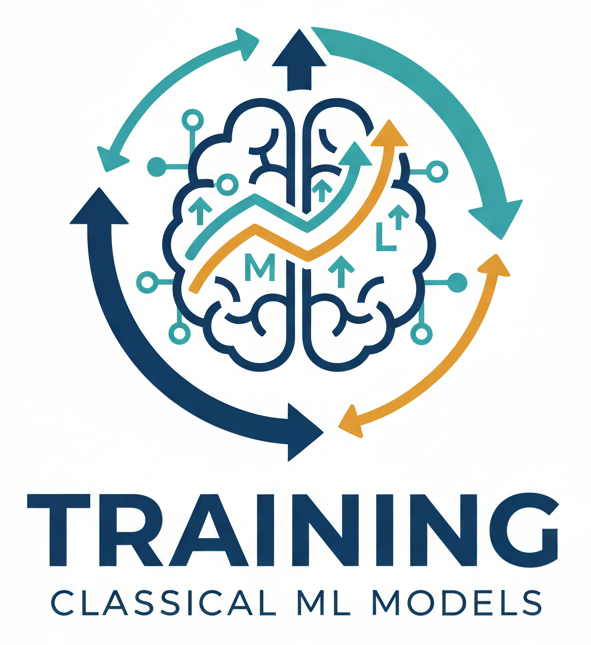

**CS 212, AI Programming 1**

<h1>Week 3 Overview for Fall 2026</h1>

<h2>Oct. 12 through Oct. 18</h2>

| Topics                                               |                               |
| ---------------------------------------------------- | ----------------------------- |
| 1. What is AI, Python                                | 6. ANN: Image recognition     |
| 2.  Symbolic AI: constraint solving                  | 7. Generative AI              |
| 3. <mark>Classical machine learning: training</mark> | 8. Custom chatbot             |
| 4. Classical machine learning: inference             | 9. LLM fine-tuning            |
| 5. Midterm                                           | 10. Social and ethical issues |
|                                                      | 11. Final                     |

<h2>Contents</h2>

- [This Week's Learning Objectives](#this-weeks-learning-objectives)
- [Announcements](#announcements)
- [Things to Do This Week](#things-to-do-this-week)

## This Week's Learning Objectives

- This week we will get started on machine learning.

  This week you will:

  - Understand basic concepts of Machine Learning (ML).
  - Understand how Bayes' Rule is applied in ML.
  - Be able to use Scikit-Learn to train an ML model.

*Image by Brian Bird using Nano Banana*

## Announcements

None yet.

## Things to Do This Week

- Lab 2 code review due by Tuesday, 10/13.
- Lab 2 production version due by Thursday, 10/15.
- Lab 3 beta version should be shared with your lab partner(s) by Saturday, 10/17.
- Take quiz 3 over the assigned reading by Sunday, 10/18.

---

 AI Programming 1 Course Materials by <a href="https://profbird.dev" target="_blank">Brian Bird</a>, written in <time>2025</time>, revised in 2026, are licensed under a <a href="http://creativecommons.org/licenses/by-sa/4.0/" target="_blank">Creative Commons Attribution-ShareAlike 4.0 International License</a>. 

---
